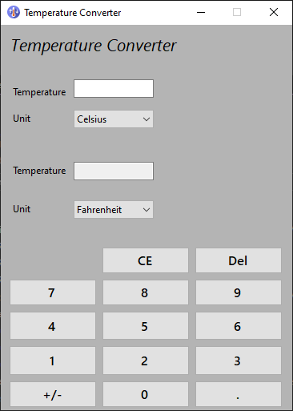

# Temperature Converter

This project is a simple Windows Forms application that allows users to convert temperatures between Celsius, Fahrenheit, and Kelvin.

## Features

- Convert between Celsius, Fahrenheit, and Kelvin
- Real-time conversion as you type
- Numeric keypad for easy input
- Input validation to ensure correct temperature format
- Clear, delete, and change sign functionalities

## How to Use

1. Enter a temperature value in the left text box using the provided numeric keypad or your keyboard.
2. Select the unit of the entered temperature from the left dropdown menu.
3. Choose the unit you want to convert to from the right dropdown menu.
4. The converted temperature will automatically appear in the right text box.

## Code Structure

The main functionality of the application is contained in the `Form` class within the `PRODIGY_SD_01` namespace. Here's an overview of the key components:

- `InitializeComboBoxes()`: Sets up the unit selection dropdown menus.
- `AttachEventHandlers()`: Connects various UI elements to their respective event handlers.
- `UpdateConversion()`: Performs the temperature conversion whenever the input changes.
- `ConvertTemperature()`: Contains the logic for converting between different temperature units.
- Various button click event handlers for the numeric keypad and other buttons.

## Temperature Conversion Methods

The class includes several methods for converting between temperature units:

- `CelsiusToFahrenheit()`
- `FahrenheitToCelsius()`
- `CelsiusToKelvin()`
- `KelvinToCelsius()`
- `FahrenheitToKelvin()`
- `KelvinToFahrenheit()`

## Input Validation

The application includes input validation to ensure that only valid numeric input (including decimal points and negative signs) is accepted. This is handled by the `Temp1TextBox_KeyPress` method.

## Development

This project is developed using C# and Windows Forms. To work on this project:

1. Ensure you have Visual Studio installed with support for .NET desktop development.
2. Open the solution file in Visual Studio.
3. The main logic is contained in the `Form.cs` file.
4. The UI design is in the corresponding `Form.Designer.cs` file
